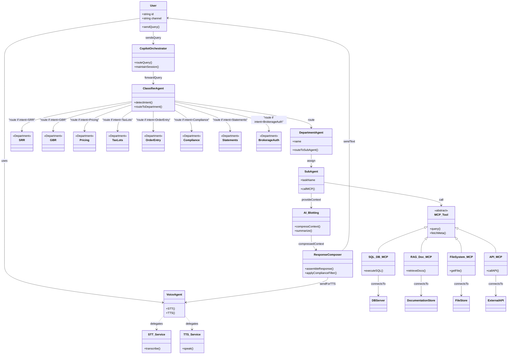

# Wealth Management Copilot — Class Diagram (Mermaid) + draw.io XML

This document contains two artifacts you asked for:

1. **Mermaid class diagram** (copy the code block below into a Mermaid renderer or a compatible Markdown editor)
2. **draw.io (diagrams.net) XML** you can import directly into diagrams.net (File → Import from → Device)

---

## 1) Mermaid class diagram



---

## 2) draw.io / diagrams.net XML

> To import: open diagrams.net (draw.io) → File → Import From → Device → paste or select this XML file.

```xml
<mxfile host="app.diagrams.net">
  <diagram name="WealthMgmtCopilot" id="m0">
    <mxGraphModel dx="1198" dy="663" grid="1" gridSize="10" guides="1" tooltips="1" connect="1" arrows="1" fold="1" page="1" pageScale="1" pageWidth="827" pageHeight="1169">
      <root>
        <mxCell id="0"/>
        <mxCell id="1" parent="0"/>

        <!-- User -->
        <mxCell id="user" value="User\n(id, channel)" style="rounded=1;fillColor=#ffffff;strokeColor=#000000;" vertex="1" parent="1">
          <mxGeometry x="40" y="40" width="140" height="60" as="geometry"/>
        </mxCell>

        <!-- Voice Agent -->
        <mxCell id="voice" value="Voice Agent\n(STT / TTS)" style="rounded=1;fillColor=#F8F9FA;strokeColor=#2E86AB;" vertex="1" parent="1">
          <mxGeometry x="220" y="30" width="160" height="60" as="geometry"/>
        </mxCell>

        <!-- Copilot Orchestrator -->
        <mxCell id="orchestrator" value="Copilot Orchestrator" style="rounded=1;fillColor=#E8F6EF;strokeColor=#117A65;" vertex="1" parent="1">
          <mxGeometry x="420" y="30" width="180" height="60" as="geometry"/>
        </mxCell>

        <!-- Classifier -->
        <mxCell id="classifier" value="Classifier Agent\n(Intent Detection)" style="rounded=1;fillColor=#FFF3E0;strokeColor=#E67E22;" vertex="1" parent="1">
          <mxGeometry x="640" y="30" width="200" height="60" as="geometry"/>
        </mxCell>

        <!-- Departments cluster -->
        <mxCell id="dept_group" value="Departments" style="rounded=1;fillColor=#FFFFFF;strokeColor=#000000;dashed=1;" vertex="1" parent="1">
          <mxGeometry x="40" y="130" width="1080" height="300" as="geometry"/>
        </mxCell>

        <!-- Department nodes -->
        <mxCell id="d_srr" value="SRR\n(Service Requests)" style="rounded=1;fillColor=#FDFEFE;strokeColor=#2C3E50;" vertex="1" parent="1">
          <mxGeometry x="80" y="160" width="160" height="60" as="geometry"/>
        </mxCell>

        <mxCell id="d_gbr" value="GBR\n(Bookkeeping)" style="rounded=1;fillColor=#FDFEFE;strokeColor=#2C3E50;" vertex="1" parent="1">
          <mxGeometry x="280" y="160" width="160" height="60" as="geometry"/>
        </mxCell>

        <mxCell id="d_pricing" value="Pricing" style="rounded=1;fillColor=#FDFEFE;strokeColor=#2C3E50;" vertex="1" parent="1">
          <mxGeometry x="480" y="160" width="160" height="60" as="geometry"/>
        </mxCell>

        <mxCell id="d_taxlots" value="Tax Lots" style="rounded=1;fillColor=#FDFEFE;strokeColor=#2C3E50;" vertex="1" parent="1">
          <mxGeometry x="680" y="160" width="160" height="60" as="geometry"/>
        </mxCell>

        <mxCell id="d_order" value="Order Entry" style="rounded=1;fillColor=#FDFEFE;strokeColor=#2C3E50;" vertex="1" parent="1">
          <mxGeometry x="880" y="160" width="160" height="60" as="geometry"/>
        </mxCell>

        <mxCell id="d_compliance" value="Compliance" style="rounded=1;fillColor=#FDFEFE;strokeColor=#2C3E50;" vertex="1" parent="1">
          <mxGeometry x="180" y="240" width="160" height="60" as="geometry"/>
        </mxCell>

        <mxCell id="d_statements" value="Statements" style="rounded=1;fillColor=#FDFEFE;strokeColor=#2C3E50;" vertex="1" parent="1">
          <mxGeometry x="380" y="240" width="160" height="60" as="geometry"/>
        </mxCell>

        <mxCell id="d_auth" value="Brokerage Auth" style="rounded=1;fillColor=#FDFEFE;strokeColor=#2C3E50;" vertex="1" parent="1">
          <mxGeometry x="580" y="240" width="160" height="60" as="geometry"/>
        </mxCell>

        <!-- Sub-agent example (for Pricing) -->
        <mxCell id="sub_pricing_1" value="Vendor Feed Analyzer" style="rounded=1;fillColor=#F7FBFC;strokeColor=#1B4F72;" vertex="1" parent="1">
          <mxGeometry x="480" y="240" width="180" height="50" as="geometry"/>
        </mxCell>

        <!-- MCP layer -->
        <mxCell id="mcp_group" value="MCP Tools" style="rounded=1;fillColor=#FFFFFF;strokeColor=#000000;dashed=1;" vertex="1" parent="1">
          <mxGeometry x="40" y="460" width="1080" height="200" as="geometry"/>
        </mxCell>

        <mxCell id="mcp_sql" value="SQL DB MCP\n(Oracle / Hive)" style="rounded=1;fillColor=#F0F3F4;strokeColor=#0B5345;" vertex="1" parent="1">
          <mxGeometry x="140" y="480" width="180" height="60" as="geometry"/>
        </mxCell>

        <mxCell id="mcp_rag" value="RAG Doc MCP\n(Rules & Manuals)" style="rounded=1;fillColor=#F0F3F4;strokeColor=#6C3483;" vertex="1" parent="1">
          <mxGeometry x="380" y="480" width="180" height="60" as="geometry"/>
        </mxCell>

        <mxCell id="mcp_file" value="FileSystem MCP\n(PDFs / Statements)" style="rounded=1;fillColor=#F0F3F4;strokeColor=#1F618D;" vertex="1" parent="1">
          <mxGeometry x="620" y="480" width="180" height="60" as="geometry"/>
        </mxCell>

        <mxCell id="mcp_api" value="API MCP\n(OMS / Market Data)" style="rounded=1;fillColor=#F0F3F4;strokeColor=#839192;" vertex="1" parent="1">
          <mxGeometry x="860" y="480" width="180" height="60" as="geometry"/>
        </mxCell>

        <!-- AI Blotting -->
        <mxCell id="blot" value="AI Blotting & Compression" style="rounded=1;fillColor=#FFF0F5;strokeColor=#C0392B;" vertex="1" parent="1">
          <mxGeometry x="420" y="600" width="260" height="60" as="geometry"/>
        </mxCell>

        <!-- Response Composer -->
        <mxCell id="composer" value="Response Composer\n(Format & Compliance)" style="rounded=1;fillColor=#F4FFFD;strokeColor=#117A65;" vertex="1" parent="1">
          <mxGeometry x="420" y="680" width="260" height="60" as="geometry"/>
        </mxCell>

        <!-- Edges -->
        <mxCell id="e1" style="edgeStyle=orthogonalEdgeStyle;rounded=0;orthogonalLoop=1;jettySize=auto;" edge="1" parent="1" source="user" target="voice"/>
        <mxCell id="e2" style="edgeStyle=orthogonalEdgeStyle;rounded=0;" edge="1" parent="1" source="voice" target="orchestrator"/>
        <mxCell id="e3" style="edgeStyle=orthogonalEdgeStyle;rounded=0;" edge="1" parent="1" source="orchestrator" target="classifier"/>

        <mxCell id="e4" style="edgeStyle=orthogonalEdgeStyle;rounded=0;" edge="1" parent="1" source="classifier" target="d_srr"/>
        <mxCell id="e5" style="edgeStyle=orthogonalEdgeStyle;rounded=0;" edge="1" parent="1" source="classifier" target="d_gbr"/>
        <mxCell id="e6" style="edgeStyle=orthogonalEdgeStyle;rounded=0;" edge="1" parent="1" source="classifier" target="d_pricing"/>
        <mxCell id="e7" style="edgeStyle=orthogonalEdgeStyle;rounded=0;" edge="1" parent="1" source="classifier" target="d_taxlots"/>
        <mxCell id="e8" style="edgeStyle=orthogonalEdgeStyle;rounded=0;" edge="1" parent="1" source="classifier" target="d_order"/>
        <mxCell id="e9" style="edgeStyle=orthogonalEdgeStyle;rounded=0;" edge="1" parent="1" source="classifier" target="d_compliance"/>
        <mxCell id="e10" style="edgeStyle=orthogonalEdgeStyle;rounded=0;" edge="1" parent="1" source="classifier" target="d_statements"/>
        <mxCell id="e11" style="edgeStyle=orthogonalEdgeStyle;rounded=0;" edge="1" parent="1" source="classifier" target="d_auth"/>

        <mxCell id="e12" style="edgeStyle=orthogonalEdgeStyle;rounded=0;" edge="1" parent="1" source="d_pricing" target="sub_pricing_1"/>
        <mxCell id="e13" style="edgeStyle=orthogonalEdgeStyle;rounded=0;" edge="1" parent="1" source="sub_pricing_1" target="mcp_sql"/>
        <mxCell id="e14" style="edgeStyle=orthogonalEdgeStyle;rounded=0;" edge="1" parent="1" source="sub_pricing_1" target="mcp_rag"/>

        <mxCell id="e15" style="edgeStyle=orthogonalEdgeStyle;rounded=0;" edge="1" parent="1" source="mcp_sql" target="blot"/>
        <mxCell id="e16" style="edgeStyle=orthogonalEdgeStyle;rounded=0;" edge="1" parent="1" source="mcp_rag" target="blot"/>
        <mxCell id="e17" style="edgeStyle=orthogonalEdgeStyle;rounded=0;" edge="1" parent="1" source="mcp_file" target="blot"/>
        <mxCell id="e18" style="edgeStyle=orthogonalEdgeStyle;rounded=0;" edge="1" parent="1" source="mcp_api" target="blot"/>

        <mxCell id="e19" style="edgeStyle=orthogonalEdgeStyle;rounded=0;" edge="1" parent="1" source="blot" target="composer"/>
        <mxCell id="e20" style="edgeStyle=orthogonalEdgeStyle;rounded=0;" edge="1" parent="1" source="composer" target="voice"/>
        <mxCell id="e21" style="edgeStyle=orthogonalEdgeStyle;rounded=0;" edge="1" parent="1" source="composer" target="user"/>

      </root>
    </mxGraphModel>
  </diagram>
</mxfile>
```

---

If you want, I can now:

* Export PNG/SVG from the draw.io XML and attach here.
* Produce a Mermaid sequence diagram that shows message flow and sample payloads.
* Convert the draw.io diagram into a JSON manifest for Copilot Studio.

Tell me which next step you prefer.
