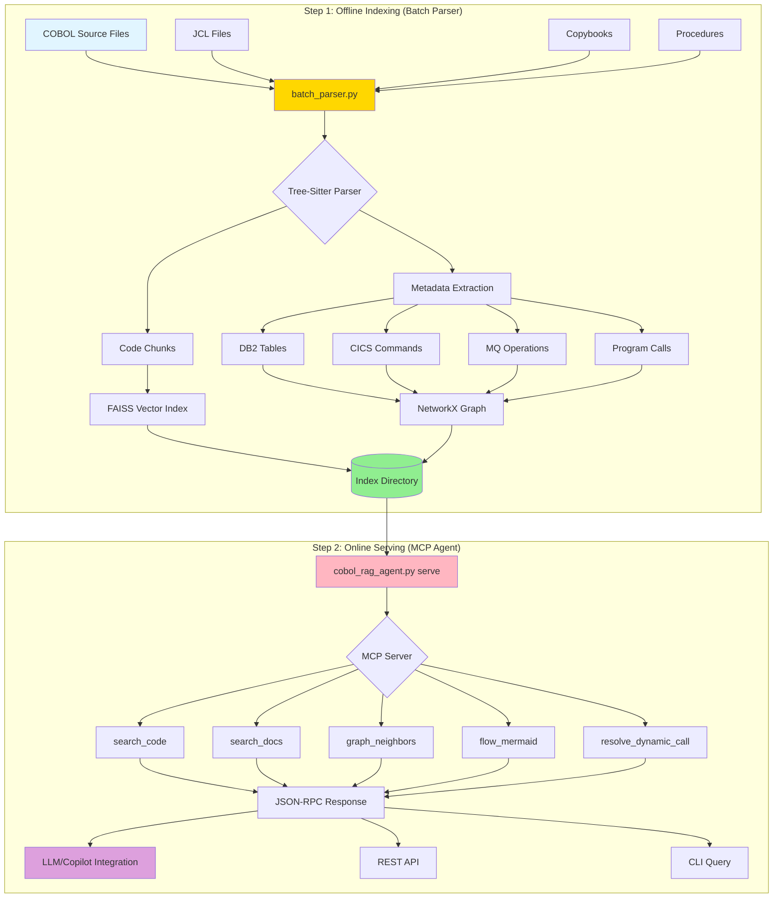

# COBOL RAG System - Complete Architecture

## Overview

The system is split into **two separate programs**:
1. **Batch Parser** (runs offline to build indexes)
2. **MCP Agent** (runs as a service to answer queries)

---

## Architecture Diagram



---

## File Structure

```
cobol-rag-system/
│
├── batch_parser.py          ← Separate indexing program
├── cobol_rag_agent.py       ← MCP server program
│
├── run_parser.sh            ← Shell script to run parser
├── quick_index.sh           ← One-liner indexing
├── scheduled_reindex.sh     ← Cron job script
│
├── index/                   ← Generated by batch_parser
│   ├── code_index.faiss     ← Vector index
│   ├── code_chunks.json     ← Code chunks
│   ├── program_graph.gpickle ← Call graph
│   ├── index_stats.json     ← Statistics
│   └── .file_tracker.json   ← File tracking
│
└── batch_parser.log         ← Parser logs
```

---

## Workflow

### Phase 1: Indexing (Offline)

```bash
# Run once to build indexes
./run_parser.sh --source /mainframe/cobol --output ./index

# Or incremental updates
./run_parser.sh --source /mainframe/cobol --output ./index --incremental

# Or watch mode (auto-reindex)
./run_parser.sh --source /mainframe/cobol --output ./index --watch
```

**What happens:**
1. Scans directory for COBOL/JCL files
2. Parses each file with Tree-Sitter
3. Extracts code chunks and metadata
4. Builds vector indexes (FAISS)
5. Constructs program call graph (NetworkX)
6. Saves everything to `index/` directory

**Output:**
- `code_index.faiss` - Semantic search index
- `code_chunks.json` - All code chunks
- `program_graph.gpickle` - Program relationships
- `index_stats.json` - Statistics

### Phase 2: Serving (Online)

```bash
# Start MCP server
python cobol_rag_agent.py serve --index-dir ./index

# Server listens on stdin/stdout for JSON-RPC requests
```

**What happens:**
1. Loads indexes from disk
2. Waits for JSON-RPC requests
3. Processes queries using loaded indexes
4. Returns results

---

## Two-Program Design Benefits

### ✅ Separation of Concerns
- **Batch Parser**: Heavy computation, runs offline
- **MCP Agent**: Lightweight, always available

### ✅ Scalability
- Index once, serve many times
- Multiple MCP servers can share same index
- No parsing overhead during queries

### ✅ Flexibility
- Re-index anytime without stopping server
- Test different parsing strategies independently
- Easy to schedule periodic reindexing

### ✅ Performance
- Queries are fast (no parsing)
- Indexing can use maximum resources
- Can run parser on different machine

---

## Typical Deployment Scenarios

### Scenario 1: Local Development

```bash
# Index your local COBOL files
python batch_parser.py --source ./my_cobol --output ./index

# Query locally
echo '{"jsonrpc":"2.0","id":1,"method":"search_code","params":{"query":"DB2 SELECT","top_k":5}}' \
  | python cobol_rag_agent.py serve --index-dir ./index
```

### Scenario 2: Production Server

```bash
# Cron job runs nightly at 2 AM
0 2 * * * /opt/cobol-rag/scheduled_reindex.sh

# MCP server runs as systemd service
systemctl start cobol-rag-mcp.service

# Applications query via JSON-RPC
```

### Scenario 3: Continuous Integration

```yaml
# .gitlab-ci.yml
stages:
  - index
  - deploy

index_job:
  stage: index
  script:
    - python batch_parser.py --source /cobol --output ./index
  artifacts:
    paths:
      - index/

deploy_job:
  stage: deploy
  script:
    - docker build -t cobol-rag-mcp .
    - kubectl apply -f k8s/deployment.yaml
```

### Scenario 4: Watch Mode (Development)

```bash
# Terminal 1: Auto-reindex on file changes
./run_parser.sh --source /mainframe/cobol --output ./index --watch

# Terminal 2: MCP server
python cobol_rag_agent.py serve --index-dir ./index

# Terminal 3: Query
echo '{"jsonrpc":"2.0","id":1,"method":"flow_mermaid","params":{"node":"prog:CUSTUPDT","depth":2}}' \
  | python cobol_rag_agent.py serve --index-dir ./index
```

---

## Process Flow Diagram

```
┌─────────────────────────────────────────────────────────────┐
│                    OFFLINE PHASE                             │
│                                                              │
│  ┌──────────┐                                               │
│  │  Place   │                                               │
│  │  Files   │ You put COBOL files in a folder              │
│  │  in      │                                               │
│  │  Folder  │                                               │
│  └────┬─────┘                                               │
│       │                                                      │
│       ▼                                                      │
│  ┌──────────┐                                               │
│  │   Run    │  ./run_parser.sh --source /folder            │
│  │  Batch   │         --output ./index                      │
│  │  Parser  │                                               │
│  └────┬─────┘                                               │
│       │                                                      │
│       ├─────► Parse COBOL files                             │
│       ├─────► Extract metadata                              │
│       ├─────► Build vector index                            │
│       ├─────► Create call graph                             │
│       │                                                      │
│       ▼                                                      │
│  ┌──────────┐                                               │
│  │  Index   │  All indexes saved to ./index/               │
│  │  Files   │  - code_index.faiss                          │
│  │  Created │  - code_chunks.json                          │
│  └──────────┘  - program_graph.gpickle                     │
│                                                              │
└─────────────────────────────────────────────────────────────┘
                             │
                             │
                             ▼
┌─────────────────────────────────────────────────────────────┐
│                    ONLINE PHASE                              │
│                                                              │
│  ┌──────────┐                                               │
│  │  Start   │  python cobol_rag_agent.py serve             │
│  │   MCP    │         --index-dir ./index                  │
│  │  Server  │                                               │
│  └────┬─────┘                                               │
│       │                                                      │
│       ├─────► Load indexes into memory                      │
│       ├─────► Listen for JSON-RPC requests                  │
│       │                                                      │
│       ▼                                                      │
│  ┌──────────┐                                               │
│  │  Accept  │  Query: "Find all DB2 operations"            │
│  │  Queries │                                               │
│  └────┬─────┘                                               │
│       │                                                      │
│       ├─────► Search vector index                           │
│       ├─────► Query graph database                          │
│       ├─────► Generate flow diagrams                        │
│       │                                                      │
│       ▼                                                      │
│  ┌──────────┐                                               │
│  │  Return  │  Results in JSON format                       │
│  │  Results │                                               │
│  └──────────┘                                               │
│                                                              │
└─────────────────────────────────────────────────────────────┘
```

---

## Key Points

### 1. Batch Parser is Independent
- Run `batch_parser.py` separately from `cobol_rag_agent.py`
- Can run on different machines
- Can run at different times

### 2. Index Once, Query Many
- Build index once (or nightly)
- MCP server uses pre-built index
- Fast queries with no parsing overhead

### 3. Three Operating Modes

**Full Index:**
```bash
python batch_parser.py --source /cobol --output ./index
```

**Incremental (only changed files):**
```bash
python batch_parser.py --source /cobol --output ./index --incremental
```

**Watch (auto-reindex on changes):**
```bash
python batch_parser.py --watch /cobol --output ./index --interval 60
```

### 4. Server Modes

**Interactive (stdin/stdout):**
```bash
python cobol_rag_agent.py serve --index-dir ./index
```

**CLI Query:**
```bash
python cobol_rag_agent.py query --query "DB2 SELECT" --index-dir ./index
```

---

## Performance Characteristics

| Operation | Batch Parser | MCP Server |
|-----------|--------------|------------|
| **CPU Usage** | High (parsing) | Low (lookup) |
| **Memory** | Moderate | Moderate |
| **Disk I/O** | Heavy (reading source) | Light (reading index) |
| **Duration** | Minutes to hours | Milliseconds |
| **Frequency** | Once or scheduled | Continuous |

---

## Summary

**YES**, the parser is a **separate program** that you run in batch mode:

1. **Put files in folder** ✓
2. **Run batch parser** ✓  
   ```bash
   ./run_parser.sh --source /folder --output ./index
   ```
3. **Indexes are built** ✓  
   Everything saved to `./index/`
4. **Then run MCP server** ✓  
   ```bash
   python cobol_rag_agent.py serve --index-dir ./index
   ```

The two programs are completely independent! You can run the parser whenever you want, and the server will use the most recent index.